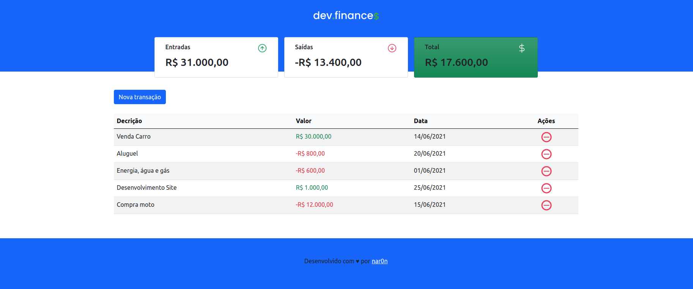

<p align="center">
  
</p>

<h1 align="center">
    
</h1>

<br>

## 🧪 Tecnologias

Esse projeto foi desenvolvido com as seguintes tecnologias:

- [HTML]
- [Bootstrap 5]
- [JavaScript]

## 🚀 Como executar

Clone o projeto e acesse a pasta do mesmo.

```bash
$ git clone https://github.com/nar0n-dev/dev-finance-mark-II
$ cd dev-finance-mark-II
```

Para iniciá-lo, siga os passos abaixo:
Basta abrir o index.html em seu navegador

## 💻 Projeto

DevFinance foi criado com o objetivo de auxiliar o usuário com as despesas do dia-a-dia, de uma forma simples e amigável de interação. Atualmente o App, armazena os dados no LocalStorage, ou seja, ao limpar o LocalStorage seus dados vão sumir, em breve farei mais atualizações.

Este é um projeto desenvolvido durante a **[Maratona Discovery]**.

Feito com 💜 por nar0n 👋🏻.